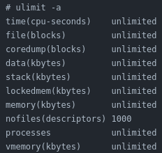

## Restricting Process

* resources are limited - more so with embedded targets
* rlimit is typically used to restrict system resources consumed by processes (i.e. restrict number of processes that can be spawned – prevent fork bombs)

::: notes
Speaker notes go here
:::
